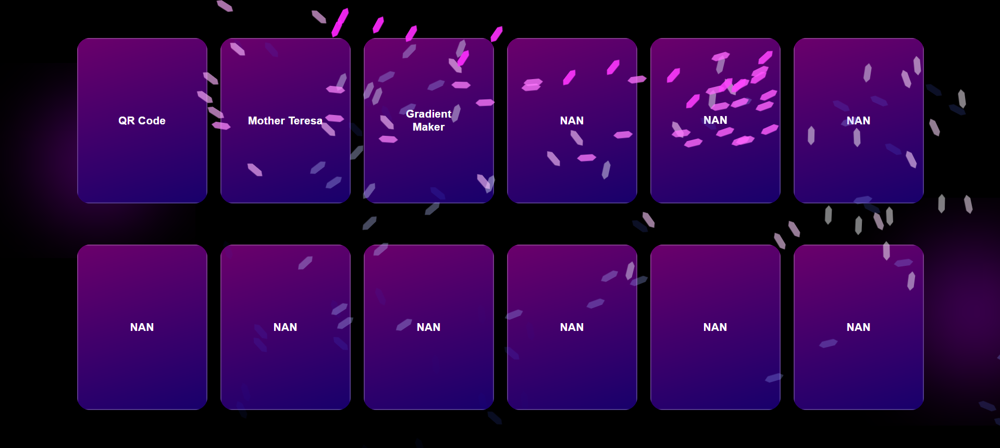

<h1 align="center" style="color:#eee;">🪣 Your_<span style="color:#EA4335;">Bucket</span></h1

<p align="center">
  <a href="https://your-bucket.vercel.app/">
    
  </a>
</p>

<p align="center">
  <a href="https://your-bucket.vercel.app/">
    
  </a>
</p>

---

## 🧰 What is "Your Bucket"?

> Your Bucket is a sleek and interactive **web tool platform** designed with a stylish red & white glow aesthetic. It includes:

- 🧠 Custom **animated cursor** & ribbon trails
- 🎨 Neon-glow **UI design** with a red/white theme
- 📦 Modular **utility cards** (QR Generator, more tools coming soon)
- 📱 Fully **responsive** layout (desktop + mobile support)

---

## 🚀 Features

- 🔮 **Custom Cursor & Ribbon Trail**
  Animated ribbon-style cursor using vanilla JavaScript + CSS

- 💡 **Neon Glow Effects**
  Smooth soft glow using pure CSS3

- 📦 **Modular Cards with Popups**
  Each tool is shown in a card — click to open its popup

- 🖥️ **Fully Responsive**
  Perfectly scales across devices (mobile, tablet, desktop)

---

## 📁 Project Structure

```
your-bucket/
├── css/
│ └── style.css # Styles for UI, glow, cursor
├── js/
│ ├── content.js # Tool logic (e.g., QR)
│ ├── script.js # Popup/card toggle logic
│ └── mouse.js # Custom cursor & effects
├── index.html # Main page
└── assets/ # Images/icons (preview, favicon)

```

---

## 🛠️ Built With

- ⚪ **HTML5**
- 🔴 **CSS3** (Glow Effects, Clip-Paths, Animations)
- ⚪ **JavaScript (Vanilla)**
- 🔴 [Typed.js](https://github.com/mattboldt/typed.js/) for typing effects
- ⚪ [Vercel](https://vercel.com) for deployment

---

## 📸 Preview


---

## 👨‍💻 Author

**Partha Batabyal**
_Student • Full-Stack Web Developer_

📧 [parthabatabyal.03.30.2004@gmail.com](mailto:parthabatabyal.03.30.2004@gmail.com)
🌐 [GitHub](https://github.com/PARTHA-BATABYAL-official)

---

## 🪄 License

This project is **open-source** and available for learning & educational use.
Give credit where due ⭐

---
